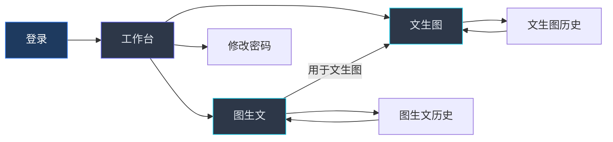
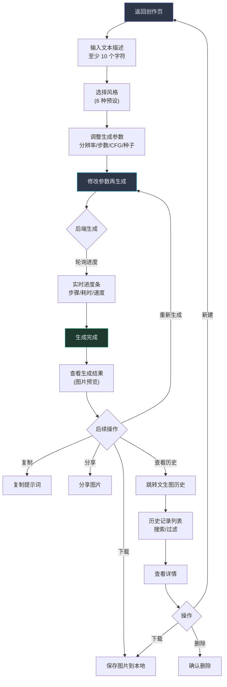
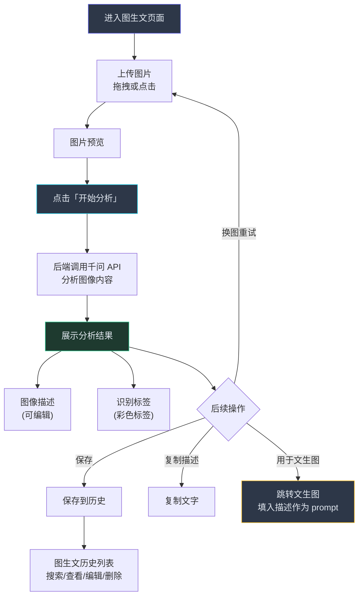

# Nebula Studio 页面线框图流转图

> 基于 13 个 HTML 原型文件、Vue Router 路由配置分析。
> 覆盖 3 个核心创作页面 + 认证/管理页面，展示三种角色的导航路径。

---

## 1. 全系统页面流转总图

```mermaid
flowchart TD
  %% 认证节点
  Login["登录页面<br/>/login"]
  Register["注册页面<br/>/register"]
  ForgotPwd["忘记密码<br/>(user_password.html)"]

  %% 主页框架
  MainLayout["MainLayout (侧边栏+顶栏)<br/>需要登录"]

  %% 普通用户页面
  Dashboard["工作台 Dashboard<br/>/"]
  Password["修改密码<br/>/password"]
  T2I["文生图 Text2Image<br/>/text2image"]
  T2I_Hist["文生图历史<br/>/text2image/history"]
  I2T["图生文 Image2Text<br/>/image2text"]
  I2T_Hist["图生文历史<br/>/image2text/history"]

  %% 设计师/管理员页面
  StyleMgmt["风格管理<br/>/styles<br/>DESIGNER / ADMIN"]

  %% 管理员页面
  AdminDashboard["系统概览<br/>/admin"]
  AdminUsers["用户管理<br/>/admin/users"]
  AdminSettings["系统配置<br/>/admin/settings"]
  AdminLogs["日志管理<br/>/admin/logs"]

  %% 404回退
  NotFound["404 / 回退<br/>→ 已登录: 工作台<br/>→ 未登录: 登录页"]

  %% 流转
  Login -->|认证成功| MainLayout
  Register -->|注册成功| Login
  ForgotPwd -->|重置完成| Login

  Login -->|未登录访问受限页面| Login

  MainLayout --> Dashboard
  MainLayout --> Password
  MainLayout --> T2I
  MainLayout --> I2T

  T2I -->|查看历史| T2I_Hist
  T2I_Hist -->|新建生成| T2I

  I2T -->|查看历史| I2T_Hist
  I2T_Hist -->|新建分析| I2T

  I2T -->|用于文生图| T2I

  Dashboard -->|快捷入口| T2I
  Dashboard -->|快捷入口| I2T
  Dashboard -->|快捷入口| StyleMgmt

  StyleMgmt -->|预览使用| T2I

  MainLayout -->|DESIGNER/ADMIN| StyleMgmt

  MainLayout -->|ADMIN only| AdminDashboard
  MainLayout -->|ADMIN only| AdminUsers
  MainLayout -->|ADMIN only| AdminSettings
  MainLayout -->|ADMIN only| AdminLogs

  AdminDashboard --> AdminUsers
  AdminDashboard --> AdminSettings
  AdminDashboard --> AdminLogs

  NotFound -->|已登录| Dashboard
  NotFound -->|未登录| Login

  Password -->|密码修改成功| Login

  style Login fill:#1e3a5f,stroke:#3b82f6,color:#fff
  style Register fill:#1e3a5f,stroke:#3b82f6,color:#fff
  style ForgotPwd fill:#1e3a5f,stroke:#3b82f6,color:#fff
  style MainLayout fill:#1a1a2e,stroke:#6366f1,color:#e2e8f0
  style Dashboard fill:#2d3748,stroke:#6366f1,color:#e2e8f0
  style T2I fill:#2d3748,stroke:#22d3ee,color:#e2e8f0
  style I2T fill:#2d3748,stroke:#22d3ee,color:#e2e8f0
  style AdminDashboard fill:#3b1d2e,stroke:#ef4444,color:#e2e8f0
  style AdminUsers fill:#3b1d2e,stroke:#ef4444,color:#e2e8f0
  style AdminSettings fill:#3b1d2e,stroke:#ef4444,color:#e2e8f0
  style AdminLogs fill:#3b1d2e,stroke:#ef4444,color:#e2e8f0
  StyleMgmt fill:#1e3a2f,stroke:#34d399,color:#e2e8f0
  Password fill:#2d3748,stroke:#fbbf24,color:#e2e8f0
```

---

## 2. 核心页面布局描述

### 2.1 工作台 (Dashboard)

**路由**: `/` — `DashboardView.vue`

**访问权限**: 所有已登录用户

**线框图布局**:

```
┌───────────────────────────────────────────────────┐
│ 侧边栏 (260px)        │  顶栏 (64px)              │
│ ┌───────────────────┐ │ ┌────────────────────────┐│
│ │ 品牌Logo + 标题    │ │ │ 页面标题  搜索🔔⚙️   ││
│ │ ───────────────── │ │ └────────────────────────┘│
│ │ 概览               │ │                           │
│ │   ● 工作台 (active)│ │  内容区                    │
│ │ ───────────────── │ │  ┌─────────────────────┐  │
│ │ 创作               │ │  │ 欢迎横幅              │  │
│ │   文生图           │ │  │ 快捷操作: [文生图]    │  │
│ │   图生文           │ │  │          [图生文]    │  │
│ │ ───────────────── │ │  │          [风格管理]   │  │
│ │ 管理               │ │  └─────────────────────┘  │
│ │   风格管理    [5]  │ │                           │
│ │   LoRA训练   [2]  │ │  ┌──┐ ┌──┐ ┌──┐ ┌──┐    │
│ │ ───────────────── │ │  │统│ │记│ │风│ │Lo│    │
│ │ 系统 (管理员可见)  │ │  │计│ │录│ │格│ │RA│    │
│ │   系统概览         │ │  │卡│ │卡│ │卡│ │卡│    │
│ │   用户管理         │ │  └──┘ └──┘ └──┘ └──┘    │
│ │   系统配置         │ │                           │
│ │   日志管理         │ │  ┌──────────────────────┐ │
│ │   模型管理         │ │  │ 最近活动   │ 热门风格  │ │
│ │ ───────────────── │ │  │ ● 文生图   │ 风格卡片  │ │
│ │ 用户头像/名称/角色│ │  │ ● 图生文   │ 网格展示  │ │
│ └───────────────────┘ │  │ ● 风格创建  │          │ │
│                       │  └──────────────────────┘ │
└───────────────────────────────────────────────────┘
```

**功能区域**:
- **侧边栏导航**: 固定 260px 宽度，深色渐变背景。分组展示概览、创作、管理、系统（仅管理员）菜单项。底部显示当前用户信息。
- **顶栏**: 粘性定位，毛玻璃效果。左侧页面标题，右侧搜索/通知/设置按钮。
- **欢迎横幅**: 渐变背景，显示用户名称、问候语和三个快捷操作按钮（文生图、图生文、风格管理）。
- **统计卡片**: 4 个指标卡（文生图作品、图生文记录、自定义风格、LoRA模型），每个带图标、数值、趋势箭头。
- **最近活动**: 列表展示用户最近的文生图、图生文、风格创建、训练等操作时间线。
- **热门风格**: 6 个热门风格卡片网格展示，含渐变预览色块、名称、使用次数。

---

### 2.2 文生图 (Text2Image)

**路由**: `/text2image` — `Text2ImageView.vue`

**访问权限**: 所有已登录用户

**线框图布局**:

```
┌───────────────────────────────────────────────────┐
│ 侧边栏            │  顶栏                          │
│  (同上)           │ 文生图                [历史]  │
│                   ├───────────────────────────────┤
│                   │  创作面板        │  生成结果    │
│                   │  ┌────────────┐ │ ┌──────────┐│
│                   │  │ 文本描述    │ │ │ 空状态    ││
│                   │  │ [textarea] │ │ │ ✨ 输入描 ││
│                   │  │ 字数: 0/500│ │ │ 述开始创作││
│                   │  ├────────────┤ │ └──────────┘│
│                   │  │ 选择风格    │ │              │
│                   │  │ [6风格网格] │ │ 或生成中:    │
│                   │  ├────────────┤ │ ┌──────────┐│
│                   │  │ 生成参数    │ │ │ 旋转动画  ││
│                   │  │ 分辨率 ▼   │ │ │ 进度条    ││
│                   │  │ 步数 -----○│ │ └──────────┘│
│                   │  │ CFG  ----○│ │              │
│                   │  │ 种子 -----○│ │ 或结果展示:  │
│                   │  ├────────────┤ │ ┌──────────┐│
│                   │  │[开始生成]  │ │ │ 图片预览  ││
│                   │  └────────────┘ │ │ [下载]    ││
│                   │                 │ │ [复制]    ││
│                   │                 │ │ [分享]    ││
│                   │                 │ │ 元数据    ││
│                   │                 │ └──────────┘│
└───────────────────────────────────────────────────┘
```

**功能区域**:
- **创作面板** (左半屏):
  - 提示词输入框: 最多 500 字符，实时字数统计，输入过长时警告变色
  - 风格选择: 6 种预设风格（赛博朋克、水墨丹青、日系清新、电商白底、写实风格、油画质感），卡片式网格，选中态高亮
  - 参数控制: 分辨率下拉（512/768/1024）、步数滑块（10-50）、CFG 比例滑块（1-20）、随机种子滑块（-1 自动 / 0-999999）
  - 生成按钮: 渐变背景，禁用态（生成中或无提示词时），点击后触发生成
- **结果面板** (右半屏):
  - 空状态: 未生成前显示引导文案
  - 生成中: 旋转动画 + 进度条（模拟扩散步数进度）
  - 结果展示: 图片预览区 + 操作按钮（下载、复制提示词、分享）+ 生成元数据（风格、步数、CFG、种子）

---

### 2.3 图生文 (Image2Text)

**路由**: `/image2text` — `Image2TextView.vue`

**访问权限**: 所有已登录用户

**线框图布局**:

```
┌───────────────────────────────────────────────────┐
│ 侧边栏            │  顶栏                          │
│  (同上)           │ 图生文                [历史]  │
│                   ├───────────────────────────────┤
│                   │  上传图像        │  分析结果    │
│                   │  ┌────────────┐ │ ┌──────────┐│
│                   │  │ 📤 拖拽或   │ │ │ ✨ 上传图 │
│                   │  │    点击上传  │ │ │ 像开始分析│
│                   │  │ JPG/PNG     │ │ └──────────┘│
│                   │  │ WebP ≤10MB  │ │              │
│                   │  └────────────┘ │ 或分析中:     │
│                   │                 │ ┌──────────┐│
│                   │  或上传后:      │ │ 旋转动画  ││
│                   │  ┌────────────┐ │ │ 正在分析.. ││
│                   │  │ 图片预览   │ │ └──────────┘│
│                   │  │ [更换]     │ │              │
│                   │  ├────────────┤ │ 或结果展示:  │
│                   │  │[开始分析]  │ │ ┌──────────┐│
│                   │  └────────────┘ │ │ 图像描述  ││
│                   │                 │ │ [可编辑]  ││
│                   │                 │ ├──────────┤│
│                   │                 │ │ 识别标签  ││
│                   │                 │ │ #城市 #夜 ││
│                   │                 │ ├──────────┤│
│                   │                 │ │ [保存]    ││
│                   │                 │ │ [复制描述]││
│                   │                 │ │ [用于文生图]│
│                   │                 │ └──────────┘│
└───────────────────────────────────────────────────┘
```

**功能区域**:
- **上传面板** (左半屏):
  - 拖拽区: 虚线边框，支持拖拽和点击上传，hover 时边框变色
  - 格式提示: 支持 JPG/PNG/WebP，最大 10MB
  - 上传后预览: 图片展示区域 + "更换"按钮
  - 分析按钮: 青色渐变，上传后启用
- **结果面板** (右半屏):
  - 空状态: 引导文案
  - 分析中: 旋转动画
  - 结果展示: 图像描述（可内联编辑）、识别标签（彩色圆角标签）、操作按钮（保存、复制描述、用于文生图→跳转到文生图页面）

---

## 3. 角色权限流转路径

### 3.1 普通用户 (USER)



**普通用户可访问页面**: 登录/注册 → 工作台 → 文生图 + 历史 → 图生文 + 历史 → 修改密码（共 5 个功能页面）

**典型用户路径**:
```
登录 → 工作台(查看统计) → 文生图(输入提示词→选择风格→调整参数→生成→查看结果→下载)
     → 图生文(上传图片→分析→查看结果→保存/用于文生图)
     → 文生图历史(搜索→查看详情→下载/删除)
     → 个人设置(修改密码)
```

---

### 3.2 设计师 (DESIGNER)

```mermaid
flowchart LR
  Login["登录"] --> Dashboard["工作台"]
  Dashboard --> T2I["文生图"]
  Dashboard --> I2T["图生文"]
  Dashboard --> Style["风格管理"]
  Dashboard --> Password["修改密码"]

  T2I --> T2I_Hist
  I2T --> I2T_Hist
  Style --> T2I["文生图中使用风格"]

  subgraph 风格管理
    Style -->|"创建/编辑风格"| Style
    Style -->|"删除风格"| Style
  end

  style Login fill:#1e3a5f,stroke:#3b82f6,color:#fff
  style Dashboard fill:#2d3748,stroke:#6366f1,color:#e2e8f0
  style T2I fill:#2d3748,stroke:#22d3ee,color:#e2e8f0
  style I2T fill:#2d3748,stroke:#22d3ee,color:#e2e8f0
  Style fill:#1e3a2f,stroke:#34d399,color:#e2e8f0
```

**设计师特有页面**: 风格管理（创建/编辑/删除风格预设）

**典型设计师路径**:
```
工作台 → 风格管理(创建新风格→填写prompt/参数→保存)
       → 文生图(选择刚创建的风格→生成图像)
       → 文生图历史(查看生成结果)
```

---

### 3.3 管理员 (ADMIN)

```mermaid
flowchart LR
  Login["登录"] --> Dashboard["工作台"]
  Dashboard --> T2I["文生图"]
  Dashboard --> I2T["图生文"]
  Dashboard --> Style["风格管理"]
  Dashboard --> Password["修改密码"]

  Dashboard --> AdminDash["系统概览"]
  Dashboard --> AdminUsers["用户管理"]
  Dashboard --> AdminSettings["系统配置"]
  Dashboard --> AdminLogs["日志管理"]

  AdminDash --> AdminUsers
  AdminDash --> AdminSettings
  AdminDash --> AdminLogs

  subgraph 管理面板
    AdminUsers -->|"创建/编辑/删除用户"| AdminUsers
    AdminSettings -->|"通用/模型/存储/安全配置"| AdminSettings
    AdminLogs -->|"搜索/过滤/导出"| AdminLogs
  end

  style Login fill:#1e3a5f,stroke:#3b82f6,color:#fff
  style Dashboard fill:#2d3748,stroke:#6366f1,color:#e2e8f0
  style AdminDash fill:#3b1d2e,stroke:#ef4444,color:#e2e8f0
  style AdminUsers fill:#3b1d2e,stroke:#ef4444,color:#e2e8f0
  style AdminSettings fill:#3b1d2e,stroke:#ef4444,color:#e2e8f0
  style AdminLogs fill:#3b1d2e,stroke:#ef4444,color:#e2e8f0
  Style fill:#1e3a2f,stroke:#34d399,color:#e2e8f0
```

**管理员特有页面**: 系统概览、用户管理、系统配置、日志管理（共 5 个管理员页面，含设计师所有权限）

**典型管理员路径**:
```
登录 → 系统概览(查看统计图表/服务状态/资源使用)
     → 用户管理(搜索用户→编辑角色/状态→创建新用户→删除用户)
     → 系统配置(通用设置→模型参数→存储配置→安全策略→保存)
     → 日志管理(按级别搜索→查看详情→导出)
     → 文生图(管理员也可创作/测试系统功能)
```

---

## 4. 核心操作流程

### 4.1 文生图完整流程



### 4.2 图生文完整流程



---

## 5. 页面关系矩阵

| 从 \ 到 | 工作台 | 文生图 | 图生文 | 文生图历史 | 图生文历史 | 风格管理 | 系统概览 | 用户管理 | 系统配置 | 日志管理 | 修改密码 |
|---------|:------:|:------:|:------:|:----------:|:----------:|:--------:|:--------:|:--------:|:--------:|:--------:|:--------:|
| **登录页** | → | — | — | — | — | — | — | — | — | — | — |
| **工作台** | — | → | → | — | — | → | *(A)* | *(A)* | *(A)* | *(A)* | → |
| **文生图** | → | — | — | → | — | — | — | — | — | — | — |
| **图生文** | → | → | — | — | → | — | — | — | — | — | — |
| **文生图历史** | → | → | — | — | — | — | — | — | — | — | — |
| **图生文历史** | → | — | → | — | — | — | — | — | — | — | — |
| **风格管理** | → | → | — | — | — | — | — | — | — | — | — |
| **系统概览** | → | — | — | — | — | — | — | → | → | → | — |
| **用户管理** | → | — | — | — | — | — | → | — | — | — | — |
| **系统配置** | → | — | — | — | — | — | → | — | — | — | — |
| **日志管理** | → | — | — | — | — | — | → | — | — | — | — |

> **说明**: → 表示可跳转，(A) 表示仅管理员可见，— 表示无直接跳转链接。
> 所有页面均可通过侧边栏导航跳转到其他权限允许的页面。

---

## 6. 侧边栏导航结构

```
概览
  ├── 工作台        ← 所有人
创作
  ├── 文生图         ← 所有人
  ├── 图生文         ← 所有人
管理
  ├── 风格管理       ← 设计师 / 管理员
  ├── LoRA训练       ← (已删除，原型保留)
系统 (仅管理员可见)
  ├── 系统概览       ← 管理员
  ├── 用户管理       ← 管理员
  ├── 系统配置       ← 管理员
  ├── 日志管理       ← 管理员
  ├── 模型管理       ← (已删除，原型保留)
```

---

## 7. 页面文件映射

| 页面名称 | Vue 组件 | HTML 原型 | 路由 |
|---------|----------|-----------|------|
| 登录 | `LoginView.vue` | `user_login.html` | `/login` |
| 注册 | `RegisterView.vue` | `user_register.html` | `/register` |
| 工作台 | `DashboardView.vue` | `dashboard.html` | `/` |
| 文生图 | `Text2ImageView.vue` | `text2image.html` | `/text2image` |
| 文生图历史 | `Text2ImageHistoryView.vue` | `text2image_history.html` | `/text2image/history` |
| 图生文 | `Image2TextView.vue` | `image2text.html` | `/image2text` |
| 图生文历史 | `Image2TextHistoryView.vue` | `image2text_history.html` | `/image2text/history` |
| 修改密码 | `PasswordView.vue` | `user_password.html` | `/password` |
| 风格管理 | `StyleManagementView.vue` | `style_management.html` | `/styles` |
| 系统概览 | `AdminDashboardView.vue` | `admin_dashboard.html` | `/admin` |
| 用户管理 | `AdminUsersView.vue` | `admin_users.html` | `/admin/users` |
| 系统配置 | `AdminSettingsView.vue` | `admin_settings.html` | `/admin/settings` |
| 日志管理 | `AdminLogsView.vue` | `admin_logs.html` | `/admin/logs` |
